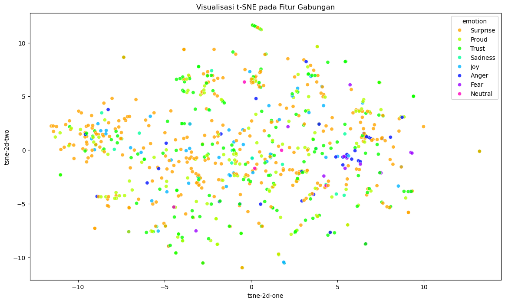

# 📑 Big Data Challenge (BDC) Satria Data 2025 – Emotion Classification

## 📌 Pendahuluan

Kompetisi **Big Data Challenge (BDC) Satria Data 2025** menantang peserta untuk membangun model klasifikasi emosi berbasis data multimedia (video).
Setiap video harus diklasifikasikan ke dalam salah satu dari 8 kategori emosi:

- Proud (Bangga)
- Trust (Percaya)
- Joy (Bahagia)
- Surprise (Terkejut)
- Neutral (Netral)
- Sadness (Sedih)
- Fear (Takut)
- Anger (Marah)

Metrik evaluasi utama adalah **Macro-averaged F1-Score**.

<div align="center">
  
</div>

---

## 📂 Struktur Dataset

Panitia memberikan dua file CSV:

- **datatrain.csv** → `id, video (URL IG), emotion` (803 video, berlabel)
- **datatest.csv** → `id, video (URL IG)` (200 video, tanpa label, untuk submission)

Hasil observasi:

- Train: 803 total → ✅ 775 berhasil diunduh, ❌ 28 gagal (video dihapus/private)
- Test: 200 total → ✅ 198 berhasil diunduh, ❌ 2 gagal

Video diunduh menggunakan `yt_dlp` dan disimpan dalam struktur folder:

```
data/
  raw/              # file CSV asli dari panitia
  processed/        # CSV yang sudah diperbaiki (label typo dibenarkan)
  video/
    train/
    test/
```

---

## ⚙️ Preprocessing & Feature Extraction

1. **Perbaikan Label**

   - Beberapa label typo (contoh: `trst` → `trust`) → dibersihkan, disimpan di `processed/`.

2. **Audio Extraction**

   - Convert `.mp4 → .wav` pakai `ffmpeg`
   - Ekstraksi fitur pakai **Librosa** → simpan ke `.npy`
   - Struktur: `features/audio/{train,test}`

3. **Visual Extraction**

   - Ambil frame per video pakai `cv2`
   - Ekstraksi fitur per frame pakai **ResNet50** (2048 dimensi)
   - Disimpan di folder `features/visual/`

4. **Text Extraction**

   - Transkripsi suara pakai **Whisper** → teks
   - Representasi teks pakai **IndoBERT** (768 dimensi)
   - Disimpan di folder `features/text/`

5. **Gabungan Fitur**

   - Audio (20) + Visual (2048) + Text (768) → Total **2836 dimensi** per video
   - Bentuk dataset akhir: `(802, 2836)`

---

## 🔍 Exploratory Data Analysis (EDA)

- **Distribusi label tidak seimbang** → _Surprise_ dominan, _Neutral_ paling sedikit.
- **t-SNE visualization** → cluster tidak terpisah jelas, kelas bercampur.
- **EDA Label**

  - Jumlah kelas unik: 8
  - Label terbanyak: _Surprise_
  - Label tersedikit: _Neutral_

---

## 🧠 Modeling

### Pendekatan:

- Model utama: **XGBoost Classifier**
- Penanganan imbalance: **SMOTE**
- Validasi: **Cross-validation (5-fold)**
- Evaluasi tambahan: **ROC-AUC Macro**

### Hasil Evaluasi

- **Confusion Matrix (ringkasan):**

  - Anger, Fear, Joy, Neutral, Sadness → hampir sempurna
  - Proud, Surprise, Trust → sering tertukar (mirip secara semantik)

- **Metric:**

  - Macro ROC-AUC: **0.9844**
  - Cross-val F1 Macro (per fold): `[0.8803, 0.8829, 0.8767, 0.8556, 0.8838]`
  - Mean CV F1 Macro: **0.8759**

👉 Kesimpulan:
Model performa **sangat baik**, dengan tantangan utama di kelas **Proud/Surprise/Trust** yang secara emosional dekat.

---

## 📊 Kesimpulan

- Pipeline **end-to-end** berhasil dibangun mulai dari raw video → fitur multimodal → model klasifikasi.
- Hasil evaluasi menunjukkan performa tinggi (**F1 Macro \~0.876**) dan konsisten antar fold.
- Tantangan utama: overlap antar emosi mirip (_Proud, Surprise, Trust_).

---

## 🚀 Next Steps

- **Optional improvement:**

  - Hyperparameter tuning (XGBoost, Random Forest, LightGBM)
  - Eksperimen dengan model multimodal lebih canggih (misalnya fusion layer, transformer-based multimodal)
  - Feature engineering tambahan

- **Untuk Submission:**

  - Pastikan prediksi data test disimpan dalam format `submission+NamaTim.csv` sesuai template.
  - Format kolom: `id, predicted` (0–7 sesuai label mapping).

---

## 📦 Reproducibility

1. **Environment**

   - Disarankan gunakan **Conda/venv**
   - Buat file `requirements.txt` dengan `pip freeze > requirements.txt`
   - Alternatif: buat `environment.yml` untuk conda

2. **Folder Structure (final):**

```
BDC2025/
  data/
    processed/
    raw/
    video/
    wav/
  features/
  notebooks/
    OO_checking_emotion.ipynb
    OO_estimation.ipynb
    Ol_download_videos.ipynb
    02_feature_extraction.ipynb
    03_feature_eda.ipynb
    04_modeling.ipynb
    05_submission.ipynb
  src/
  submission/
  README.md
  requirements.txt
```

---

## 📝 Catatan

- Beberapa video gagal diunduh (28 train, 2 test) → dibiarkan missing.
- Librosa sempat crash → diselesaikan dengan downgrade versi.
- Ekstraksi fitur memakan waktu cukup lama (\~5 jam total).
